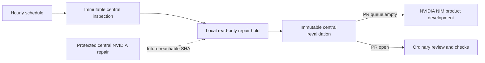

# ADR 0006: Fail closed when the central repair workflow is unreachable

- **Status:** Accepted
- **Date:** 2026-08-07

## Context

The hourly RankWeave workflow composed central inspection, review repair,
revalidation, and local NVIDIA NIM product development. Its review-repair call
was pinned to a central commit that became unreachable from protected central
history. GitHub rejected each scheduled caller before creating jobs, disabling
the whole loop.

The current protected central repair implementation still uses GitHub Models,
while a reviewed NVIDIA NIM replacement remains outside protected main. Calling
either the orphaned SHA, mutable central `main`, or an unmerged branch would
violate the product's credential and immutable-source boundaries.

## Decision

Keep the two immutable reachable merge-scheduler calls. Replace review repair
with a local read-only hold job until the protected central NVIDIA NIM repair
engine is available at a reachable immutable SHA. The hold job may inspect only
the open-PR count and must not receive mutation, OIDC, provider, or inherited
secret permissions.

## Consequences

- The hourly workflow executes instead of failing during reusable-workflow
  resolution.
- PR inspection and revalidation continue each hour.
- Product development can proceed when all governance jobs succeed and the PR
  queue is empty.
- Review repair remains unavailable rather than silently routing through an
  unapproved provider or mutable control plane.
- Re-enabling repair requires a focused PR that pins the protected central
  NVIDIA scheduler and updates tests, operations documentation, and this ADR's
  supersession record.

## Diagram

