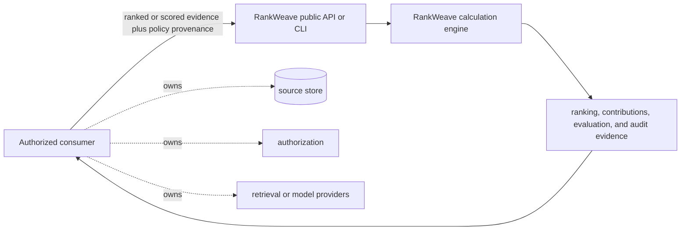

# RankWeave Product Requirements

Status: Candidate product contract

Product: `ContextualWisdomLab/RankWeave`

Normative architecture: repository ADRs, including
[`ADR 0006`](adr/0006-rust-calculation-core.md), and `AGENTS.md`

Supporting evidence: [`docs/research/README.md`](research/README.md)

## 1. Product purpose

RankWeave is the store-agnostic calculation and audit boundary for retrieval
fusion, ranking evaluation, paired and family-wise comparison, fixed-policy
selection, temporal backtesting, and strict TREC interchange. It runs as a
standalone Python package and CLI and as an imported module in products such as
Naruon and LineageWeave.

The product turns caller-owned ranked or scored evidence into deterministic,
inspectable ranking evidence. It does not retrieve source records, authorize a
reader, select a model, call a provider, or infer business facts.

## 2. Users and jobs

| User | Job | Required evidence |
| --- | --- | --- |
| Retrieval engineer | Combine heterogeneous retrieval channels | Ordered results, exact channel contributions, input policy, and deterministic tie behavior |
| Evaluation researcher | Compare systems on complete judgment sets | Per-query metrics, effect estimate, raw inference evidence, and declared experimental boundary |
| Platform integrator | Embed fusion without copying an engine | Stable typed API, wheel contract, fail-closed validation, and immutable version pin |
| Release operator | Run auditable comparisons in CI | Bounded CLI input, versioned JSON, artifact digests when requested, and stable exit behavior |
| Auditor | Reconstruct what produced a ranking decision | Algorithm/policy identity, ordered inputs, limitations, and integrity-bound artifacts |

## 3. Product principles

1. **One arithmetic owner.** Consumers supply evidence and policy; they do not
   copy RankWeave fusion or evaluation arithmetic.
2. **No invented signal.** Within an explicitly active channel policy, a
   candidate absent from one channel contributes that scoring function's
   documented theoretical minimum. An unavailable channel, query, judgment,
   policy, or artifact is unavailable or invalid and must not be silently
   converted into an active zero-valued channel.
3. **No arbitrary policy.** Channel weights, folds, cutoffs, test alternatives,
   and candidate families are caller-provided, research-grounded inputs with
   provenance. RankWeave does not guess them.
4. **Complete auditability.** Public results retain the evidence necessary to
   reproduce ordering, contributions, metrics, and statistical comparison.
5. **Experiment separation.** Policy selection uses declared validation or
   training evidence; held-out and temporal assessment remain distinct from
   final all-data recommendations.
6. **Deterministic compatibility.** Identifier alignment, ordered tie breaks,
   bounded parsing, and versioned schemas are public contracts.

## 4. Functional requirements

### 4.1 Fusion

- Accept caller-owned scored or rank-only channel results and an explicit,
  compatible policy.
- Reject non-finite values, invalid domains, duplicate identifiers, and
  incompatible channel/policy sets before calculation.
- Return a deterministic complete ranking with exact per-channel contribution
  evidence. Represent candidate-level absence explicitly and apply the
  documented theoretical-minimum semantics; never use those semantics to hide
  that an entire policy channel was unavailable.
- Preserve first-seen order where the documented public contract resolves an
  exact score tie by input order.
- Introduce no LineageWeave-specific threshold, candidate window, database
  query, or authorization rule.

### 4.2 Semantic-unit vector ranking

- Accept one caller-authorized query vector and ordered semantic-unit vectors.
- Reject invalid vector-space evidence rather than padding or inventing a
  fallback score.
- Return deterministic per-item winning-unit evidence and versioned ordered
  input integrity evidence.
- Do not select an embedding model, apply authorization, or infer a threshold.

### 4.3 Evaluation and comparison

- Require complete ranking/judgment query-set parity.
- Produce per-query and aggregate precision, recall, reciprocal-rank, and
  graded nDCG evidence under the documented metric definitions.
- Align paired comparisons by query identifier and preserve every difference.
- Expose exact or deterministic Monte Carlo randomization evidence and keep
  p-values separate from effect size and deployment value.
- Compare an explicit ordered candidate family against one baseline and retain
  raw plus Holm-adjusted evidence in the original candidate order.

### 4.4 Policy assessment

- Evaluate only caller-declared, ordered policy families.
- Keep validation selection, explicit-fold out-of-fold assessment, temporal
  assessment, and final all-data recommendation as distinct result objects.
- Accept caller-owned fold and availability-time boundaries; never generate a
  hidden random split or claim that a supplied grouping is leakage-safe.

### 4.5 TREC and CLI interoperability

- Parse and format the documented TREC run and qrels profiles with bounded
  memory and stable physical-line diagnostics.
- Emit exactly one versioned UTF-8 JSON document on success and no stdout on an
  expected CLI error.
- Preserve default v1 documents; artifact digests and byte counts are explicit
  v2 contracts and disclose no local paths.
- Package strict Draft 2020-12 schemas for every emitted report contract.

## 5. Quality requirements

- Production behavior is deterministic for identical ordered inputs.
- Public modules, records, errors, and CLI transports remain backward
  compatible under ADR 0005.
- Statement, branch, public-docstring, wheel-install, CLI, schema, and edge-case
  checks remain complete for every release candidate.
- Inputs are bounded and fail closed at trust boundaries. Integrity digests are
  not described as authentication, attestation, or scientific validity.
- Release authorization and PyPI publication use exact immutable source and
  artifact evidence; a source-only commit is not a released consumer contract.

## 6. Architecture and ecosystem boundary

- Naruon owns retrieval, source access, and its package-version upgrade.
- LineageWeave owns authorized lineage evidence and consumes released
  RankWeave results; it does not own fusion arithmetic.
- TEPP and fast-mlsirm own psychometric measurement and estimation. RankWeave
  may consume provenance-bearing policies but does not invent a theta or
  reimplement those models.
- contextual-orchestrator owns LLM and model-routing decisions.

The current release remains dependency-free Python. This development head
moves theoretical min-max normalization and unweighted RRF into the Rust core;
issue #45 tracks the remaining fusion and evaluation migration under ADR 0006.
Until a Rust-backed release is published and pinned, consumers must not claim
the engine is available to them.

## 7. Explicit non-goals

- Database, search-index, HTTP, ORM, identity, or authorization integration.
- Provider/model discovery, embedding generation, OCR, VISION, or LLM
  orchestration.
- Hidden score normalization, generated weights, inferred folds, generated
  candidate families, or automatic production deployment.
- Psychometric estimation, causal interpretation, or business-value scoring.
- A product UI; RankWeave supplies library, CLI, and machine-readable evidence
  contracts. Consumer products own rendered interaction design.

## 8. Release acceptance

A release is acceptable only when one exact source head proves:

1. all public vectors and edge cases pass under the documented semantics;
2. line, branch, and public-docstring coverage are complete;
3. Ruff, full tests, wheel build, isolated install, console/module entrypoints,
   schema validation, and package-content checks pass;
4. research and ADR traceability matches every changed numerical contract;
5. CHANGELOG and synchronized version metadata describe the same artifact;
6. governed protected-branch review and immutable publication evidence are
   complete; and
7. each consumer separately upgrades to the released version or immutable
   source pin before claiming the capability.

## 9. Current product gaps

The evidence ledger and prioritized acceptance gaps live in
[`docs/product-technical-gap-baseline.md`](product-technical-gap-baseline.md).
In particular, issue #45 must preserve this contract while replacing duplicate
consumer arithmetic with one Rust-backed production engine; it must not use the
migration to add local policies or unsupported performance claims.
