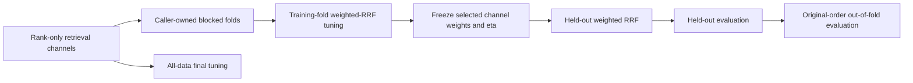

# Weighted-RRF explicit-fold cross-validation

RankWeave can estimate a fixed weighted reciprocal-rank-fusion policy-selection
procedure on caller-defined held-out folds. The API is deterministic,
standard-library-only, store-agnostic, and suitable as either a standalone
experiment primitive or a small module inside naruon or another MSA.

## Why this exists

Rank-only retrieval channels are common when systems expose ordered candidates
but not calibrated scores. Examples include lexical, dense, learned-sparse,
graph, federated, and external provider rankings. A single validation split can
select one set of channel weights, but its observed objective is not an unbiased
estimate of the selection procedure's future performance.

`cross_validate_weighted_reciprocal_rank_fusion` repeats selection on explicit
training folds and applies the selected fixed policy unchanged to held-out
queries. It preserves every training tuning report and every held-out evaluation,
then reconstructs one aggregate out-of-fold evaluation in original query order.



`out_of_fold_evaluation` and `final_tuning` answer different questions. The
former estimates the declared selection procedure under the supplied folds. The
latter recommends one policy using all available judgments and is not held-out
performance.

## Public API

```python
from rankweave import cross_validate_weighted_reciprocal_rank_fusion

report = cross_validate_weighted_reciprocal_rank_fusion(
    channel_rankings_by_query={
        "query-a1": {
            "lexical": ["a", "x"],
            "dense": ["x", "a"],
        },
        "query-b1": {
            "lexical": ["y", "b"],
            "dense": ["b", "y"],
        },
        "query-a2": {
            "lexical": ["c", "z"],
            "dense": ["z", "c"],
        },
        "query-b2": {
            "lexical": ["w", "d"],
            "dense": ["d", "w"],
        },
    },
    relevance_by_query={
        "query-a1": {"a": 3},
        "query-b1": {"b": 3},
        "query-a2": {"c": 3},
        "query-b2": {"d": 3},
    },
    candidate_channel_weights={
        "dense-heavy": {"lexical": 0.1, "dense": 0.9},
        "lexical-heavy": {"lexical": 0.9, "dense": 0.1},
    },
    fold_id_by_query={
        "query-a1": "blocked-a",
        "query-b1": "blocked-b",
        "query-a2": "blocked-a",
        "query-b2": "blocked-b",
    },
    cutoff=10,
    rank_constant_eta=60,
)
```

## Evidence retained

Each `WeightedRRFCrossValidationFold` preserves:

- the caller's fold identifier;
- exact complementary training query identifiers;
- exact held-out query identifiers;
- the complete immutable `WeightedRRFTuningReport` used to select weights;
- the complete immutable held-out `RankingEvaluationReport`.

`WeightedRRFCrossValidationReport` preserves:

- cutoff;
- the one fixed `rank_constant_eta` used everywhere;
- selected objective;
- every fold in first-query appearance order;
- one aggregate out-of-fold evaluation in original input-query order;
- a separately labelled all-data final tuning report.

Every tuning report retains all candidate policies, ordered channel weights,
objective scores, and complete per-query evaluations. Exact policy ties remain
deterministic because the first candidate wins.

## Input and validation contract

- Ranking and judgment mappings contain exactly the same non-empty query set.
- Fold assignments contain exactly that query set.
- At least two distinct, hashable fold identifiers are required.
- Cutoff and `rank_constant_eta` are positive integers; booleans are rejected.
- The policy family is non-empty and insertion ordered.
- Channel weights are finite, non-negative, and sum to one.
- Item identifiers are hashable and unique within each channel ranking.
- Every ranking channel has a declared weight.
- Missing item evidence in a channel contributes zero.
- The same eta is used in training tuning, held-out fusion, and final tuning.

Errors fail closed. RankWeave never removes a malformed query or returns a
partial report.

## Fold ownership and leakage

The caller owns fold construction. Keep related observations together whenever
the deployment question requires it, including:

- translations and paraphrases of one information need;
- revisions or synthetic variants of one source;
- repeated queries from one user or tenant;
- one event, project, customer, or opportunity;
- one temporal assessment block.

RankWeave preserves explicit fold IDs because random query-level splitting can
underestimate error when observations are dependent. The library cannot prove
that a supplied grouping is leakage-safe.

## Interpretation boundary

Cross-validation evaluates the complete weight-selection procedure. It does not
turn the all-data winner into an unbiased performance estimate. After selecting
a final policy:

1. freeze the exact channel weights and eta;
2. apply them once to an independent held-out test set;
3. report effect size and uncertainty against the relevant baseline;
4. retain validation, cross-validation, and test evidence separately.

This API does not generate a hidden weight grid, tune eta, learn query-adaptive
weights, normalize scores, create folds, deploy a policy, establish causality,
or prove commercial value.

## References — APA 7th edition

Cawley, G. C., & Talbot, N. L. C. (2010). On over-fitting in model selection and
subsequent selection bias in performance evaluation. *Journal of Machine
Learning Research, 11*, 2079–2107.

Cormack, G. V., Clarke, C. L. A., & Büttcher, S. (2009). Reciprocal rank fusion
outperforms Condorcet and individual rank learning methods. In *Proceedings of
the 32nd International ACM SIGIR Conference on Research and Development in
Information Retrieval* (pp. 758–759). Association for Computing Machinery.
https://doi.org/10.1145/1571941.1572114

Roberts, D. R., Bahn, V., Ciuti, S., Boyce, M. S., Elith, J., Guillera-Arroita,
G., Hauenstein, S., Lahoz-Monfort, J. J., Schröder, B., Thuiller, W., Warton,
D. I., Wintle, B. A., Hartig, F., & Dormann, C. F. (2017). Cross-validation
strategies for data with temporal, spatial, hierarchical, or phylogenetic
structure. *Ecography, 40*(8), 913–929.
https://doi.org/10.1111/ecog.02881

Samuel, S., DeGenaro, D., Guallar-Blasco, J., Sanders, K., Eisape, O.,
Spendlove, T., Reddy, A., Martin, A., Yates, A., Yang, E., Carpenter, C.,
Etter, D., Kayi, E., Wiesner, M., Murray, K., & Kriz, R. (2025). MMMORRF:
Multimodal multilingual modularized reciprocal rank fusion. In *Proceedings of
the 48th International ACM SIGIR Conference on Research and Development in
Information Retrieval*. Association for Computing Machinery.
https://doi.org/10.1145/3726302.3730157

Stone, M. (1974). Cross-validatory choice and assessment of statistical
predictions. *Journal of the Royal Statistical Society: Series B
(Methodological), 36*(2), 111–133.
https://doi.org/10.1111/j.2517-6161.1974.tb00994.x
