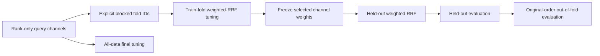

# Weighted-RRF Cross-Validation Design

## Status

Approved for autonomous implementation under the standing RankWeave
commercialization loop. This is one bounded retrieval-evaluation slice. It adds
rank-only policy-selection cross-validation without changing existing convex
cross-validation behavior, TREC transports, database boundaries, scheduler
credentials, or publication policy.

## Buyer-visible problem

RankWeave can tune weighted reciprocal-rank-fusion policies on one judged
validation set, but only normalized-score convex fusion has an explicit-fold
cross-validation API. Buyers combining lexical, dense, learned-sparse, graph, or
external retrieval channels as rank-only lists must currently write their own
fold orchestration. That bespoke glue can:

- select weights on held-out queries;
- misalign query identifiers;
- vary `rank_constant_eta` between training and assessment;
- lose the complete training tuning evidence;
- silently omit failed queries from aggregate metrics;
- produce nondeterministic policy ties.

The product should expose the same blocked-fold selection boundary for weighted
RRF that it already exposes for convex score fusion.

## Considered approaches

### A. Copy the convex implementation and substitute RRF functions

This is easy to implement but duplicates fold validation, query accounting, and
out-of-fold reconstruction. The two paths would drift and could reject different
invalid inputs. Rejected.

### B. Extract strategy-neutral fold validation and add a dedicated RRF path

Keep public convex and RRF APIs explicit, while sharing the query-universe, fold
assignment, objective, cutoff, and candidate-family validation helpers. Each
public function delegates to its existing native tuner and fusion primitive.
This preserves understandable public types and avoids a second metric engine.
Recommended.

### C. Replace both public APIs with one callback-driven generic cross-validator

A fully generic public engine would reduce internal code, but it would expose
callbacks, complicate typing and serialization, and weaken the clear distinction
between normalized-score and rank-only contracts. It would also create an
unnecessary compatibility migration. Rejected.

## Public API

```python
from rankweave import cross_validate_weighted_reciprocal_rank_fusion

report = cross_validate_weighted_reciprocal_rank_fusion(
    channel_rankings_by_query,
    relevance_by_query,
    candidate_channel_weights,
    fold_id_by_query,
    cutoff=10,
    rank_constant_eta=60,
)
```

New frozen records:

- `WeightedRRFCrossValidationFold`
- `WeightedRRFCrossValidationReport`

The report records:

- the positive cutoff;
- the positive integer `rank_constant_eta` used for every training and held-out
  calculation;
- the selected aggregate objective;
- every fold in first-query appearance order;
- exact training and held-out query identifiers;
- the complete immutable `WeightedRRFTuningReport` for every fold;
- the complete held-out `RankingEvaluationReport` for every fold;
- one original-query-order aggregate out-of-fold evaluation;
- a separately labelled full-data final tuning recommendation.

## Data flow



`out_of_fold_evaluation` estimates the supplied policy-selection procedure under
the caller's fold design. `final_tuning` uses every judgment and is a future
recommendation, not held-out performance.

## Validation and error handling

The implementation reuses one strategy-neutral validation boundary for convex
and RRF cross-validation:

- cutoff must be a positive integer and reject booleans;
- objective must be one of the established tuning objectives;
- candidate policy family must be non-empty;
- ranking/result and judgment query sets must match exactly and be non-empty;
- fold assignments must match the complete query set exactly;
- fold identifiers must be hashable;
- at least two distinct folds are required;
- query order and first fold appearance define deterministic output order.

The RRF path then delegates rank and weight domains to existing native
contracts:

- channel weights are finite, non-negative, and sum to one;
- ranks are derived from unique ordered item identifiers;
- duplicate or unhashable items fail closed;
- result channels without weights fail closed;
- `rank_constant_eta` is a positive integer and is held fixed across all folds;
- missing item evidence contributes zero according to weighted RRF semantics.

No exception is converted to a partial report.

## Scientific interpretation

The caller owns fold construction. Translations, paraphrases, revisions, users,
tenants, events, projects, and time blocks that must remain together receive the
same fold identifier. RankWeave does not generate random folds or claim that a
caller-provided split is leakage-safe.

Cross-validation estimates the complete selection procedure, not the quality of
the all-data winning policy. After model selection, consumers freeze the final
weights and evaluate them once on an independent held-out test set before a
production-quality claim.

Weighted RRF remains a fixed-policy method. This slice does not introduce
query-adaptive routing, learn `rank_constant_eta`, generate a hidden policy grid,
or deploy a selected configuration.

## Research grounding

- Cormack, Clarke, and Büttcher (2009) define reciprocal-rank fusion as a
  rank-only fusion method.
- Samuel et al. (2025) demonstrate modality-aware weighted RRF when channels
  have unequal reliability.
- Stone (1974), Cawley and Talbot (2010), and Roberts et al. (2017) ground the
  separation of selection and assessment and the need for blocked folds when
  observations are related.

Full APA 7th references are recorded in `docs/research/README.md` and the new
operator documentation.

## Modularity and compatibility

- Runtime remains Python 3.10+ and standard-library-only.
- Public convex cross-validation behavior and type names remain unchanged.
- RRF orchestration calls `tune_weighted_reciprocal_rank_fusion`,
  `weighted_reciprocal_rank_fuse`, and `evaluate_rankings`; it does not copy
  tuning, fusion, or metric arithmetic.
- The API is store-, provider-, and transport-agnostic and can be imported by
  naruon or another MSA consumer.
- No database, network, UI, LLM, scheduler, or credential change is included.

## Release and verification

This additive public API prepares RankWeave 0.18.0. The release synchronizes
package metadata, public version, `uv.lock`, version tests, `CHANGELOG.md`, README,
architecture and agent guidance, installed-wheel smoke, and release archive
inspection.

The exact head must pass:

- Python 3.10, 3.11, 3.12, and 3.13;
- `compileall` and Ruff;
- the complete pytest suite;
- 100% production statement and branch coverage;
- complete production docstrings;
- wheel and source-distribution inspection;
- source-tree-external installed-wheel smoke;
- dependency consistency;
- Security Scan and SAST Semgrep;
- current-head review with zero unresolved threads.

## Spec self-review

- **Placeholder scan:** no TODO, TBD, or deferred requirement remains.
- **Consistency:** the public records, data flow, validation, docs, tests, and
  release scope all describe one fixed-eta weighted-RRF cross-validation slice.
- **Scope:** one algorithm-parity subsystem; temporal backtesting, CLI transport,
  query-adaptive routing, and deployment are excluded.
- **Ambiguity:** fold order, tie handling, eta ownership, held-out interpretation,
  and final-tuning interpretation are explicit.
