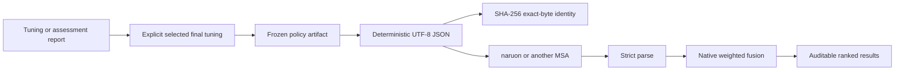

# Canonical Fusion Policy Artifacts Design

- **Status:** Approved for autonomous implementation
- **Date:** 2026-08-07
- **Scope:** Portable, fail-closed deployment artifacts for fixed RankWeave fusion policies

## Problem

RankWeave can tune, cross-validate, and backtest fixed convex-score and weighted-RRF policies, but the selected policy currently exists only inside Python report objects. A buyer must manually copy channel weights and, for RRF, `rank_constant_eta` into another service. That manual handoff creates four commercial risks:

1. transcription and channel-order drift;
2. accidental use of validation or final-tuning evidence as a deployment contract;
3. incompatible ad hoc JSON across naruon and other MSA consumers; and
4. no exact-byte identity for the policy that produced a production ranking.

## Goals

1. Publish one strict, versioned, standard-library-only policy transport.
2. Preserve channel order as audit evidence and reject duplicate or invalid channels.
3. Support fixed weighted-convex and fixed weighted-RRF policies without duplicating fusion arithmetic.
4. Create policies directly from existing tuning and assessment reports while labelling the source evidence honestly.
5. Parse untrusted JSON fail-closed, rejecting duplicate object names, non-standard numbers, extra fields, and unsupported versions.
6. Emit deterministic UTF-8 bytes and compute SHA-256 over the exact emitted bytes.
7. Package a JSON Schema Draft 2020-12 resource and expose it through the existing schema-discovery API.
8. Remain usable as a standalone Python package and as a small naruon/MSA module.

## Non-goals

- Full RFC 8785 JSON Canonicalization Scheme conformance.
- Digital signatures, producer authentication, trusted execution, or SLSA provenance claims.
- Adaptive per-query or per-item weighting.
- Provider score normalization, policy search, model deployment, database storage, or remote fetches.
- Automatically declaring a cross-validation or all-data winner production-safe.

## Selected transport

The public schema identifier is:

```text
rankweave.fusion-policy.v1
```

A weighted-convex artifact is shaped as follows:

```json
{
  "schema_version": "rankweave.fusion-policy.v1",
  "policy_kind": "weighted_convex",
  "policy_id": "lexical-heavy",
  "channel_weights": [
    {"channel_name": "lexical", "weight": 0.8},
    {"channel_name": "dense", "weight": 0.2}
  ],
  "rank_constant_eta": null,
  "selection_source": "full_data_tuning"
}
```

A weighted-RRF artifact uses `policy_kind: "weighted_rrf"` and a positive integer `rank_constant_eta`. The complete channel mapping is an array rather than a JSON object so caller-owned channel order survives every language and serializer.

### Field contracts

- `schema_version` is exactly `rankweave.fusion-policy.v1`.
- `policy_kind` is exactly `weighted_convex` or `weighted_rrf`.
- `policy_id` is a non-empty printable Unicode string without leading or trailing whitespace and no control characters.
- `channel_weights` is non-empty and ordered.
- `channel_name` is a non-empty printable Unicode string without leading or trailing whitespace and no control characters.
- Channel names are unique.
- Every weight is a finite JSON number in `[0, 1]` and the complete sum satisfies RankWeave's existing convex-weight contract.
- `rank_constant_eta` is `null` for weighted convex and a positive non-boolean integer for weighted RRF.
- `selection_source` is one of `validation_tuning`, `blocked_cross_validation_final_tuning`, `temporal_backtest_final_tuning`, or `full_data_tuning`.
- No additional fields are accepted.

## Python API

```python
from rankweave import (
    FusionPolicyArtifact,
    FusionPolicyChannelWeight,
    apply_fusion_policy,
    fusion_policy_from_convex_tuning,
    fusion_policy_from_rrf_tuning,
    parse_fusion_policy,
    serialize_fusion_policy,
    sha256_fusion_policy,
)
```

### Immutable records

```python
@dataclass(frozen=True)
class FusionPolicyChannelWeight:
    channel_name: str
    weight: float

@dataclass(frozen=True)
class FusionPolicyArtifact:
    schema_version: str
    policy_kind: str
    policy_id: str
    channel_weights: tuple[FusionPolicyChannelWeight, ...]
    rank_constant_eta: int | None
    selection_source: str
```

Both constructors enforce the public contract. Direct construction cannot bypass parser validation.

### Constructors from existing evidence

`fusion_policy_from_convex_tuning` accepts a `WeightedConvexTuningReport`, an explicit string `policy_id`, and an explicit `selection_source`. The `policy_id` must equal the selected report policy when that selected identifier is a string; non-string report identifiers require the caller to supply an explicit transport-safe ID and are not silently stringified.

`fusion_policy_from_rrf_tuning` follows the same rule and preserves the report's fixed eta.

Cross-validation and temporal-backtesting callers extract their separately labelled `final_tuning` report and must choose the matching `selection_source`. The artifact records how the policy was selected but contains no quality score, p-value, or claim that selection evidence is independent test performance.

### Serialization and parsing

`serialize_fusion_policy` emits one compact UTF-8 JSON document followed by one newline. Field order is fixed by the implementation and channel-array order is preserved. The encoder rejects NaN and infinity.

This transport is deterministic but is **not described as RFC 8785 JCS**. Python's standard serializer does not implement ECMAScript number serialization and UTF-16 property sorting required by RFC 8785. The narrow RankWeave contract instead makes emitted bytes stable for its own fixed field set and parsed value domain.

`parse_fusion_policy` accepts `str`, requires strict RFC 8259 JSON, rejects duplicate member names and non-standard constants, requires an object root, then constructs the frozen artifact. It does not read a file or access a network.

`sha256_fusion_policy` hashes the exact bytes returned by `serialize_fusion_policy`. Equality is an integrity binding only. It is not a signature, publisher identity, attestation, or provenance statement.

### Applying policies

`apply_fusion_policy` accepts exactly one artifact and exactly one compatible input mode:

- `channel_results` for `weighted_convex`;
- `channel_rankings` for `weighted_rrf`.

It delegates to `weighted_convex_fuse` or `weighted_reciprocal_rank_fuse`. It does not duplicate scoring, validation, ordering, or contribution arithmetic.

## JSON Schema

Package `src/rankweave/schemas/fusion-policy-v1.schema.json` using JSON Schema Draft 2020-12. The schema requires every field, rejects additional properties at every object level, uses ordered array items for channel weights, enforces selector enums and string patterns, and expresses the `policy_kind`/`rank_constant_eta` conditional with `if`/`then`/`else`.

The existing schema discovery API adds one descriptor:

```text
report_type = "policy"
schema_version = "v1"
transport_schema_id = "rankweave.fusion-policy.v1"
```

The runtime continues to have no JSON Schema validator dependency. Development tests validate real emitted artifacts with the pinned `jsonschema` extra.

## Data flow



## Error handling

All malformed input raises `ValueError` with stable, specific diagnostics. Internal packaged-schema absence remains `RuntimeError`, consistent with the existing schema API. No partial artifact or partial ranking is returned.

## Testing

Tests use real policy reports and hand-computed rankings rather than mocks.

- direct constructors and parsers accept valid convex and weighted-RRF artifacts;
- duplicate JSON keys, extra properties, non-object roots, NaN/infinity, invalid selectors, boolean eta, non-convex weights, duplicate channels, padded/control-containing IDs, and incompatible input modes fail closed;
- serialize → parse → serialize is byte-identical;
- SHA-256 changes when channel order, weight, eta, policy ID, or selection source changes;
- policies constructed from actual tuning reports reproduce direct native fusion results exactly;
- real emitted artifacts validate against the packaged Draft 2020-12 schema;
- installed-wheel smoke loads the schema, creates, serializes, hashes, parses, and applies both policy kinds outside the source tree;
- production statement and branch coverage remain 100%, with complete public docstrings on Python 3.10–3.13.

## Compatibility and release

This is an additive public transport and API, released as RankWeave `0.19.0`. Update package metadata, `uv.lock`, public version, version tests, installed-wheel assertions, README, architecture, agent guidance, release documentation, research grounding, and `CHANGELOG.md` together.

Naruon adoption remains a separate reviewed change after the public 0.19.0 wheel and source distribution are published and independently verified. RankWeave does not claim a source-only API is already available to a consumer pinned to an older PyPI version.

## Standards and authority

National Institute of Standards and Technology. (2015). *Secure Hash Standard (SHS)* (FIPS PUB 180-4). https://doi.org/10.6028/NIST.FIPS.180-4

Rundgren, A., Jordan, B., & Erdtman, S. (2020). *JSON Canonicalization Scheme (JCS)* (RFC 8785). RFC Editor. https://doi.org/10.17487/RFC8785

SLSA. (2026). *Provenance (SLSA specification v1.2)*. https://slsa.dev/spec/v1.2/provenance

Wright, A., Andrews, H., Hutton, B., & Dennis, G. (2022). *JSON Schema: A media type for describing JSON documents* (Draft 2020-12). JSON Schema. https://json-schema.org/draft/2020-12/json-schema-core.html

The RFC 8785 citation defines what full JSON canonicalization would require and supports RankWeave's explicit decision not to overclaim conformance. FIPS 180-4 grounds SHA-256. JSON Schema Draft 2020-12 grounds the packaged structural contract. SLSA grounds the distinction between a digest and provenance.
