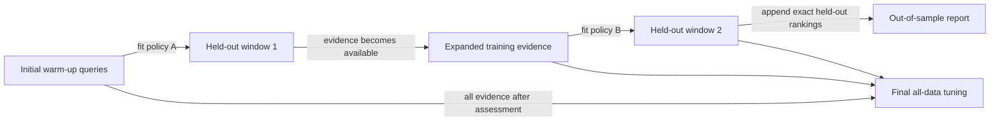

# Temporal convex-fusion backtesting

RankWeave can evaluate a fixed convex score-fusion policy-selection procedure
without allowing evidence from a future assessment period to enter an earlier
training window. The API is deterministic, standard-library-only, store-agnostic,
and usable either directly or as a small module inside naruon or another MSA.

## Why availability time matters

An event may happen before a document is published, indexed, received, or
otherwise usable by a retrieval system. Ordering experiments by event time or
document creation time can therefore admit evidence that was not yet available
when a historical policy decision would have been made.

`available_time_by_query` records the earliest instant at which the complete
scored results and judgments supplied for a query were available to policy
selection. RankWeave accepts only timezone-aware `datetime` values and normalizes
them to UTC. It never guesses a timezone or derives availability from another
clock.

For every assessment window RankWeave enforces:

```text
max(training available time) < min(held-out available time)
```

The strict inequality prevents same-instant observations from being split across
training and assessment.



The out-of-sample path always flows from earlier available evidence to a later
assessment. `final_tuning` deliberately sits on a separate path because it uses
all available evidence and is a deployment recommendation rather than a
historical performance estimate.

## Public API

```python
from datetime import datetime, timezone

from rankweave import (
    WeightedConvexBacktestWindowDefinition,
    backtest_weighted_convex_fusion,
)

UTC = timezone.utc

report = backtest_weighted_convex_fusion(
    channel_results_by_query={
        "q0": {
            "lexical": [("a", 1.0), ("x", 0.0)],
            "dense": [("x", 1.0), ("a", 0.0)],
        },
        "q1": {
            "lexical": [("b", 1.0), ("y", 0.0)],
            "dense": [("y", 1.0), ("b", 0.0)],
        },
        "q2": {
            "lexical": [("z", 1.0), ("c", 0.0)],
            "dense": [("c", 1.0), ("z", 0.0)],
        },
        "q3": {
            "lexical": [("w", 1.0), ("d", 0.0)],
            "dense": [("d", 1.0), ("w", 0.0)],
        },
    },
    relevance_by_query={
        "q0": {"a": 1},
        "q1": {"b": 1},
        "q2": {"c": 1},
        "q3": {"d": 1},
    },
    candidate_channel_weights={
        "dense-heavy": {"lexical": 0.1, "dense": 0.9},
        "lexical-heavy": {"lexical": 0.9, "dense": 0.1},
    },
    available_time_by_query={
        "q0": datetime(2026, 1, 1, tzinfo=UTC),
        "q1": datetime(2026, 1, 2, tzinfo=UTC),
        "q2": datetime(2026, 1, 3, tzinfo=UTC),
        "q3": datetime(2026, 1, 4, tzinfo=UTC),
    },
    windows=(
        WeightedConvexBacktestWindowDefinition(
            window_id="assessment-1",
            training_query_ids=("q0", "q1"),
            held_out_query_ids=("q2",),
        ),
        WeightedConvexBacktestWindowDefinition(
            window_id="assessment-2",
            training_query_ids=("q0", "q1", "q2"),
            held_out_query_ids=("q3",),
        ),
    ),
    cutoff=1,
)
```

## Window and query-accounting contract

The caller owns the assessment design. RankWeave does not infer timestamps,
generate windows, or silently reorder them.

- Window identifiers are unique and hashable.
- Training and held-out query sequences are non-empty, unique, and disjoint
  within each window.
- Every query identifier is known to the scored-result and judgment universes.
- Held-out query sets are disjoint across windows.
- Held-out time ranges are strictly ordered.
- The first window's training set is the initial warm-up set.
- Every query belongs either to that warm-up set or to exactly one held-out
  window.
- Warm-up queries may never later become held out.
- A query may enter training only after its own earlier held-out assessment has
  occurred; this supports expanding or caller-defined rolling retention without
  leaking a later assessment query into an earlier policy fit.

These checks make the exact retraining cadence and retention policy reviewable
rather than hidden inside an automatic splitter.

## Evidence retained

Each `WeightedConvexBacktestWindow` preserves:

- the window identifier;
- exact training and held-out query IDs;
- the latest UTC training availability time;
- the earliest and latest UTC held-out availability times;
- the complete immutable tuning report;
- the selected fixed channel weights;
- exact held-out rankings;
- the full held-out evaluation report.

`WeightedConvexBacktestReport` preserves every window, reconstructs all
out-of-sample rankings in original input-query order, computes one aggregate
out-of-sample evaluation, and separately returns all-data `final_tuning`.

The two summaries answer different questions:

- `out_of_sample_evaluation` estimates the declared historical
  selection-and-retraining procedure on future windows;
- `final_tuning` recommends one fixed policy using all currently available
  evidence for a future deployment.

`final_tuning.best_objective_score` is not prospective or held-out performance.

## Scientific and operational boundaries

This procedure is a time-respecting retrieval experiment, not a claim that
queries form a classical univariate time series. It does not establish
stationarity, causality, calibration, economic value, or validity outside the
supplied query population.

Availability provenance remains a consumer responsibility. A timestamp is only
as trustworthy as the ingestion, publication, access-control, and revision
history from which it was derived. Persist the source event, document version,
ingestion record, and availability decision beside the RankWeave input artifact.

For repeated users, tenants, translated queries, document revisions, or other
related observations, define windows at the appropriate higher-level unit so
correlated evidence is not divided across training and assessment. RankWeave
keeps the grouping decision explicit rather than assuming query-level
independence.

## References — APA 7th edition

Bergmeir, C., & Benítez, J. M. (2012). On the use of cross-validation for time
series predictor evaluation. *Information Sciences, 191*, 192–213.
https://doi.org/10.1016/j.ins.2011.12.028

Cerqueira, V., Torgo, L., & Mozetič, I. (2020). Evaluating time series
forecasting models: An empirical study on performance estimation methods.
*Machine Learning, 109*(11), 1997–2028.
https://doi.org/10.1007/s10994-020-05910-7

Tashman, L. J. (2000). Out-of-sample tests of forecasting accuracy: An analysis
and review. *International Journal of Forecasting, 16*(4), 437–450.
https://doi.org/10.1016/S0169-2070(00)00065-0
